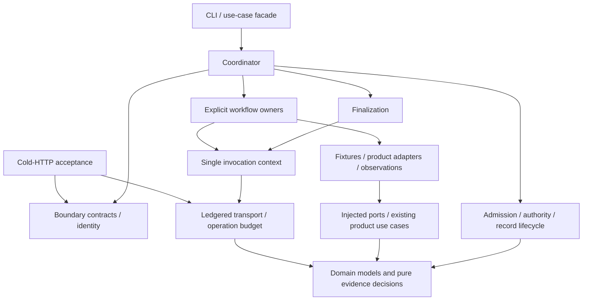

# Server-service qualification architecture refactor

## Purpose and observed problem

The user prioritizes comprehensive refactoring of the large qualification
implementation before continuing SP2. The intended outcome is a maintainable,
extensible qualification subsystem that preserves coexistence with product
services, commissioning, cold-HTTP acceptance, SP1, SP2 and existing diagnostics.

At the starting commit, application/use_cases/qualify_server_services.py has
11,667 physical lines, 24 top-level classes and 146 top-level functions.
Including nested definitions gives 26 classes and 238 functions. Its largest
class, _Execution, has 439 lines/26 methods; its largest function,
_run_q3_native_serve, has 521 lines. The primary problem is therefore one mixed
module owning execution controls, authorization, durable lifecycle, product
adapters, evidence decisions and multiple workflows.

A read-only AST inventory of all 400 tracked production Python files is retained
at data/services/qualification-refactor/source-inventory-ece5fca.json. One file
exceeds 10,000 lines, four exceed 5,000, and nine exceed 3,000. Physical size is
screening evidence; it does not establish a design defect or an ISO violation.

The existing source baseline has 8,757 passing tests, six skips and three
warnings; exact-SHA CI36764012258 completed all six jobs successfully.
This design changes no runtime code. Implementation evidence will be collected
on its own exact candidate.

## Engineering basis

The repository's incremental V-Model and risk-L controls govern this work.
The following published ISO references were checked against official abstracts
on 2026-09-30:

| Reference | Application in this change |
| --- | --- |
| [ISO/IEC/IEEE 42010:2022](https://www.iso.org/standard/74393.html) | Document stakeholder concerns, component ownership, dependencies, execution and compatibility views, and the rationale for boundaries. |
| [ISO/IEC 25010:2023](https://www.iso.org/standard/78176.html) | Express measurable product-quality objectives for maintainability, compatibility and performance through acceptance evidence. |
| [ISO/IEC/IEEE 12207:2026](https://www.iso.org/standard/90219.html) | Record the change lifecycle from requirements/design through implementation, verification, review and delivery. |
| [ISO/IEC/IEEE 29148:2018](https://www.iso.org/standard/72089.html) | Pair explicit requirements with acceptance evidence and preserve traceability. The official page identifies a replacement draft under development. |
| [ISO/IEC/IEEE 29119-2:2021](https://www.iso.org/standard/79428.html) | Organize verification processes and retain actual test outcomes. |

These references inform project decisions. They do not prescribe a Python
module size, package structure or design pattern. This brief claims neither ISO
certification nor full clause-level conformance; the full normative texts were
not assessed.

## Scope and stakeholders

The primary scope is the entire qualification application module, its actual
consumers, and narrowly shared responsibilities that must acquire a clear owner.
Existing domain models, injected runtime ports and CLI composition remain the
basis of the system.

Stakeholders are maintainers extending stages, operators depending on bounded
effects and cleanup, application consumers depending on stable contracts, and
reviewers auditing records and claims. Their concerns are change isolation,
readability, testability, resource bounds, compatibility and evidence integrity.

Protected boundaries include historical evidence, consumed campaign accounting,
public capability grants, four-input product registration, SP1 behavior and C31
input/hash reconstruction. The failed e8 record remains a failed observation.
No new native qualification is part of structural verification.

Other large files receive a ranked backlog in this brief. Whole-subsystem
changes to them are separate work; small shared-boundary changes are justified
only by a concrete dependency of this refactor.

## Requirements and acceptance

| ID | Requirement | Acceptance evidence |
| --- | --- | --- |
| QR01 | Preserve effect admission, uncertainty, stopping and guaranteed finalization semantics. | Existing positive/negative coordinator, authority-loss, cancellation, persistence and cleanup tests; deterministic before/after execution traces. |
| QR02 | Preserve operation/time ceilings, purposes, reserve protection and fixed-channel behavior. | Same counted dispatches, timeout/wait values, phase transitions and budget outcomes under identical injected clocks and transport results. |
| QR03 | Preserve consumers and canonical type identity. | Public entry signature/exports, CLI and SP1/SP2 composition tests; old and new imports reference the same class/enum objects. Record schemas, compact summaries and exit codes remain equivalent. |
| QR04 | Give each workflow and shared control one cohesive owner. | Explicit dependency DAG, no stage-to-stage imports, no stage import of coordinator/facade, and one mutable invocation context. Existing stage coverage maps completely to explicit handlers. |
| QR05 | Keep deterministic evidence decisions independent of backend effects. | Pure assessment tests consume domain facts; application observation tests use injected ports; domain imports no application/infrastructure modules. |
| QR06 | Preserve test fault injection and executable mutation containment. | Migrate private monkeypatch targets with their actual owners; retain original behavioral assertions and narrowly reviewed AST footprint classifications. |
| QR07 | Preserve scalability costs and source/evidence meaning. | Existing constructed populations, scan sharing, dispatch/resource bounds and persisted meanings pass; no new whole-workspace/per-client shared-table work. Historical archive/hash checks remain intact. |
| QR08 | Deliver a reproducible independently reviewable candidate. | Focused/affected/full verification, Ruff, namespace, docs, whitespace, clean exact-commit gate, exact-SHA six-job CI and independent architecture/code review. |

Acceptance uses architectural and behavioral evidence together. Renaming files
or meeting an arbitrary line threshold does not satisfy QR04.

## Architecture decisions

### Chosen approach

Introduce application/server_service_qualification/ with clear ownership
modules and explicit workflow functions. Keep
application/use_cases/qualify_server_services.py as the stable entry façade.
The façade owns the public entry signature and explicit compatibility exports;
it contains no experimental workflow implementation.

This approach addresses the complete module while preserving the existing
execution engine. A class hierarchy for every experiment would add abstraction
without a demonstrated polymorphic requirement. Splitting solely by stage
would preserve current hidden helper sharing and create cycles. Shared controls
and observations therefore acquire owners before workflow extraction.

### Component ownership

| Owner | Responsibility and current source anchors |
| --- | --- |
| contracts.py | Existing input/output DTOs and injected boundary contracts, including Q3ProductContract and QualificationBoundaries (:795–1228). |
| operation_budget.py | OperationLedger, LedgerPhase and refusal semantics (:365–676). |
| ledgered_transport.py | Counted fixed-channel dispatch and typed uncertainty (:680–788). |
| campaign_authority.py | Claim ownership, local process continuity and release (:1754–1965; live_authority :2516). |
| record_lifecycle.py | Initial record, write-ahead transitions, budget synchronization and completion (:1982–2145). |
| execution.py | One invocation's mutable state, preconditions, measurement transitions, stop rules and callback registration (:2392–2830). |
| fixtures.py | Owned fixture setup, collision handling and bounded readiness (:2836, :2899, :3230, :3397). |
| product_support.py | Exact-inventory adapters, E5/E6 projections and product integration used by several workflow families (:835–966, :4634, :6683, :9191). |
| dhcp_observations.py | Counted and purpose-labelled server/client/pool observation orchestration (:3600–3770, :9037, :10044). |
| finalization.py | Terminal callbacks, owned release/removal, two restoration observations and primary/secondary outcomes (:11251–11667). |
| coordinator.py | Local admission, boundary resolution, channel lifecycle, explicit handler dispatch and finalization (:1305–1751, :2148–2370). |

Workflow ownership follows distinct existing contracts: engine; HTTPS/page;
original DHCP; DHCP diagnostics; native pool probes/stability/serve; native
public product; SP1 routed product; SP2 mixed/capacity; SP2 remote relay;
fastloop/acquisition; and web diagnostics. Each may have cohesive phase helpers.
The 521-line native serve procedure will expose its preparation, observation,
assessment and conclusion phases with typed outcomes rather than moving intact
without clarifying its control flow.

Shared fastloop/native/remote DHCP snapshots and foundation handling move into
shared owners where their contracts actually agree. Router terminal completeness
is not owned by a remote-relay workflow simply because of its current name.

Pure binding, lease-prefix, router-row and product-evidence predicates belong
in narrowly scoped domain services. They receive domain facts instead of
application Q3ProductContract instances. Vendor error decoding remains at its
backend boundary. Distinct evidence predicates retain distinct meanings.

### Dependency and execution views

The execution order remains admission and write-ahead record, then one channel,
fresh build/workspace observations, bounded fixtures/workflows, terminal
observations and guaranteed owned finalization. Every engine call remains
ledgered. State and cleanup are not duplicated among workflow owners.

Workflow modules import neither one another nor the façade/coordinator.
The context imports no workflow or finalization module; it registers callbacks.
Contracts and ports have no dependency on workflow implementation. Concrete
backend construction remains in adapters/infrastructure.

### Coexistence and compatibility

OperationLedger is also consumed by accept_cold_http.py:137.
Q3ProductContract is consumed by the SP1/SP2 CLI compositors; the qualification
CLI imports nine boundary/result types. Canonical definitions move once and are
explicitly re-exported through the old path. No sys.modules aliases, wildcard
export machinery or parallel namespace is introduced.

Re-exporting a function does not preserve monkeypatches of globals in its old
module. Private test imports and patches move with the owner, for example:
test_diagnostic_residual_corrections.py:625,654,1270,1571;
test_sp2_remote_relay_stage.py:1519–1529; and
test_native_dhcp_product_stage.py:220–231. Their causal assertions remain.
OperationLedger.can_afford patches continue to reference the same class object.

Mutation-footprint classification at
tests/test_transport_mutation_containment.py:256–262 requires an exact reviewed
owner update; the new package does not receive a blanket exemption.

Two narrow shared seams require design during migration:
- _path_admission and _dhcp_prelease_paths are privately imported from
  apply_enterprise_services.py (:306–313, :8519–8532). Give shared path admission
  a named application owner consumed by both callers, preserving its algorithm.
- Private ServiceCompiler._semantic_hash calls (:6790, :7536) should consume a
  named canonical domain identity function. Preserve canonicalization exactly
  and retain the compiler's compatibility method if its consumers need it.

## Verification and migration strategy

Implementation uses one integration writer in this worktree and native read-only
audits where useful. Staged migration is the means to complete the whole module,
not acceptance of a partially extracted architecture.

The dependency order is contracts/budget/transport; durable state/authority;
execution and finalization; shared fixture/product/observation/evidence owners;
workflows and their phase decomposition; then façade/consumer migration and
whole-subsystem review. Existing consumer tests cover each extraction before
broader verification. Maintain the original public entry throughout.

Use existing fake-clock, stateful Node and transport harnesses to compare
successful and failing traces. Compare effect order, dispatch counts/purposes,
timeouts/waits, persisted transitions, facts/causes, primary/secondary errors,
terminal calls, ownership and final record meaning. Only explicitly identified
source-identity fields differ when a new candidate is created.

Useful existing suites include service_qualification_coordinator,
service_qualification_contracts, diagnostic_residual_corrections,
diagnostic_focused_corrections, sample_episode_phase_boundaries,
native_dhcp_product_stage, q3_fastloop_coordinator, sp2_remote_relay_stage,
transport_mutation_containment and associated native/capacity contracts.
Broader coexistence verification includes SP1 routed readiness, commissioning
reconstruction, DHCP/Voice/Printer and CP-SCALE contracts.

New architecture checks enforce dependency directions and canonical identities.
New unit tests exercise actual seam input/output/error contracts. Do not invent
RED to accompany a behavior-preserving move or weaken existing assertions.
Any discovered behavioral defect receives a separate causal regression and an
explicit disposition before its behavior changes.

Final delivery requires the checkout-local environment, verified cisco/main,
full suite, namespace/docs/whitespace checks, clean exact delivery gate,
normal feature publication where authorized, exact-SHA CI and independent
review. A green original baseline does not verify moved code. Offline
equivalence establishes no new native capability.

## Ranked inventory of other large modules

| Priority | File and size | Actual concern / disposition |
| --- | --- | --- |
| Next candidate | adapters/mcp/tool_registry.py — 5,525 | register_tools has 63 tool handlers and 30 other nested functions plus bridge/session ownership. Existing service-family registration (:2973–2980) and deferred session extraction (:2969–2972) provide concrete seams. Public signatures/token/channel sharing need preservation. |
| Next candidate | infrastructure/execution/enterprise_service_runtime.py — 6,248 | One 5,178-line runtime class owns generation, privacy, dispatch, DHCP sampling, DNS/mail and web lifecycle. Preserve shared sanitizer, lock, release ownership and chronological/group caches when splitting collaborators. |
| Follow-up | infrastructure/execution/enterprise_configuration_runtime.py — 4,450 | A 3,841-line class mixes application, verification and forwarding observations. Its separate bounded forwarding channel (:543–560) is a real seam; distinct budget/pager rules remain distinct. |
| Follow-up | application/use_cases/qualify_positive_voice_slice.py — 5,305 | Experiment orchestration, causal result derivations and lifecycle share a boundary. Result evaluation and orchestration are separate owners; control/intervention and cleanup are contracts. |
| Catalogue review | domain/enterprise/models/service_qualification.py — 4,570 | 3,093 lines are stage/fixture/intent catalogue (:399–3491), not a giant class. Keep schemas, catalogue construction and admission ownership clear; 26 source importers make arbitrary splitting costly. |
| Narrow shared seam | domain/enterprise/services/service_compiler.py — 2,799 | Mostly cohesive pure compilation. Address canonical plan identity as needed; broad compiler decomposition is not required by this task. |

Generated multiline non-docstring literals account for approximately 530 lines
in the service runtime and 673 in the registry; they do not explain their entire
size. Additional screening entries include ios_terminal.py (3,734),
apply_enterprise_services.py (3,242), server_pt_commissioning.py (3,201),
enterprise_control_plane_runtime.py (2,531), and control_plane_compiler.py
(2,492). These counts alone are not refactoring findings.

## Known outstanding integration issue

SP2 e8 is closed and restored but failed and unsealed. Its maintained product
reference selector recognizes M-NATIVE-PRODUCT and M-SP1-ROUTED-PRODUCT but omits
SP2 measurement IDs (adapters/cli/service_qualification.py:1289).
That behavior remains an explicitly tracked defect; historical e8 accounting
and missing references must not be rewritten during structural migration.
A prospective causal fix requires its own tested behavior disposition.
The operational handoff is data/services/sp2-governed/handoff-e8-20260930.json.

## Design review boundary

The user approved this written risk-L design on 2026-09-30 with
"Aprobar y continuar". Design review is complete; implementation is not yet
claimed. Prepare the detailed execution plan within this same change record,
preserving the repository's single-brief rule, and continue the authorized
implementation. Routine implementation decisions inside this approved contract
do not require renewed permission. A material contract change requires review.

Final refactor status is READY_FOR_REVIEW only after QR01–QR08 are evidenced.
Independent review accepts the refactor; SP2 product acceptance remains a
separate unfulfilled outcome.

## Executable implementation plan

Added in version 1.1.0, before any runtime change, from a full read of the
module, its dependency graph and every consumer. It refines the approved
ownership inside the approved contract; it changes no requirement.

### Consumers found before moving code

- Production: the qualification CLI (nine names plus the entry), the SP-1 and
  SP-2 CLI compositors (`Q3ProductContract`) and `accept_cold_http.py`
  (`OperationLedger`, `LedgerPhase`, `LedgeredTransport`, `RuntimeIdentity`).
- Tests: 26 files. Private imports and patches reach `_d_web_after`,
  `_d_web_fetch`, `_d_web_switch_ports`, `_sp2_remote_scan`,
  `_sp2_remote_snapshot`, `apply_enterprise_services`, `_Execution`, `_Run`,
  `_initial_record`, `_finalize`, `_run_q1`, `_run_q3`, `_snapshot_facts`,
  `_Q3ConfigurationRuntime`, `_q3_e5_foundation_cause`,
  `_q3_service_result_cause`, `_sp1_terminal_bindings_observed`,
  `_sp2_first_probe_read`, `_sp2_mixed_scan_complete`, `_sp2_remote_client`,
  `_sp2_remote_contract_mismatch` and, through `getattr`, the two SP-2 remote
  terminal predicates. `OperationLedger.can_afford` is patched on the class.
- Gitignored SP-2 operator tooling: `sp2-governed/continuation-tools/make_episode.py`
  and its immutable e7/e8/helper-closure copies import ten `SP2_MIXED_*` and
  `SP2_CAPACITY_*` hash constants, `_sp2_capability_digest` and
  `_sp2_mixed_normalized_services_hash` from the old module path.
  `sp2-governed/source-freeze-v2.json` pins the old module's SHA-256; that
  historical freeze is not rewritten, and the next SP-2 continuation needs a
  fresh freeze of the refactored tree.

### Target layout and ownership

`application/server_service_qualification/` holds the subsystem; the old
module remains the façade. A name used only inside its owner keeps its exact
name. A name imported by another owner loses only its leading underscore,
except where the old name misattributes a shared responsibility; those
renames are listed here and nowhere else.

| Module | Owns (renamed from) |
| --- | --- |
| `contracts.py` | `SendAndWait`, `MAX_DETAIL`, `bounded`, `IsolationObservation`, `RuntimeIdentity`, `Q3ProductContract`, `QualificationBoundaries`, `CampaignQualificationAuthority`, `QualificationResult`, `QualificationCancelled`, `refused_result` (`_refused`) |
| `operation_budget.py` | `LedgerPhase`, `OperationRefused`, `OperationLedger`, `counted_seq` |
| `ledgered_transport.py` | `LedgeredTransport` and its private raised-call outcome |
| `campaign_authority.py` | `CampaignHold`, claim release, diagnostic admission and its composed-boundary table, and `ExecutionAuthority` (the live-authority decision formerly inside `_Execution`) |
| `record_lifecycle.py` | `initial_record`, `Run` |
| `execution.py` | `NOT_SELECTED`, `TerminalPhase`, `Execution` |
| `fixtures.py` | `setup_fixtures`, `diagnostic_start`, `Readiness`, `await_readiness`, `fixture_endpoints`, `endpoint_action_id`, `configure_web_fixture` (`_configure_q1`, shared by Q1 and D-WEB) |
| `product_support.py` | `DIAGNOSTIC_TAKES_ITS_OWN_FORWARDING_EVIDENCE`, `ExactInventoryConfigurationRuntime` (`_Q3ConfigurationRuntime`), `ExactInventoryServiceRuntime` (`_Q3ServiceRuntime`), `RoutedInventoryConfigurationRuntime` (`_Sp1ConfigurationRuntime`), `q3_endpoint_plan`, `q3_server_plan`, `product_runtime_context` (`_q3_context`), `exact_inventory_runtimes` (`_d_dhcp_runtimes`), `projection_foundations` (`_q3fl_foundations`), `application_rows` (`_q3fl_rows`), `capability_digest` (`_sp2_capability_digest`), the terminal router capture bounds and the shared product invocation helpers extracted from the three product workflows |
| `dhcp_observations.py` | the three native-default purposes, `q3_client_rows`, the default-pool reading and persistence functions, `DhcpAcquisitionClient` (`_Q3FlClient`), `dhcp_acquisition_clients` (`_q3fl_clients`), `DhcpObservationState` (the shared fields of `_Q3FlState`), `scan_dhcp_pools` (`_q3fl_scan`), `read_acquisition_clients` (`_q3fl_read_clients`), `native_default_snapshot` (`_q3fl_snapshot`), `read_client_binding` (`_sp2_read_binding`) |
| `finalization.py` | `observe_terminal`, `release_campaign_claim`, `finalize` and their private helpers |
| `coordinator.py` | `run_qualification` (the body of the entry), product-contract resolution, the channel lifecycle, the admission reads, the explicit stage-handler table and guaranteed finalization |
| `workflows/engine.py` | Q0 |
| `workflows/https_page.py` | Q1 and `FETCH_OPERATIONS` |
| `workflows/original_dhcp.py` | Q3 |
| `workflows/dhcp_diagnostics.py` | D-DHCP |
| `workflows/native_pool.py` | Q3-NATIVE probe, size, policy, stability and serve |
| `workflows/native_product.py` | Q3-NATIVE-PRODUCT |
| `workflows/sp1_routed_product.py` | SP-1 routed product |
| `workflows/sp2_mixed_product.py` | SP-2 mixed and capacity product, `sp2_mixed_normalized_services_hash` |
| `workflows/sp2_remote_relay.py` | SP-2 remote relay |
| `workflows/fastloop.py` | Q3-FL and SP-2 native pool, with `_Q3FlState` extending `DhcpObservationState` |
| `workflows/web_diagnostics.py` | D-WEB |
| `domain/.../qualification_product_evidence.py` | `e5_foundation_cause` (`_q3_e5_foundation_cause`), `service_result_cause` (`_q3_service_result_cause`), `readback_not_observed_cause` (`_d_dhcp_readback_cause`) |
| `domain/.../qualification_terminal_evidence.py` | `sp1_terminal_bindings_observed`, `sp2_mixed_bindings_usable`, `sp2_mixed_scan_complete`, `sp2_mixed_server_complete`, `terminal_router_rows_complete` (`_sp2_remote_terminal_rows_complete`) |
| `domain/.../sp2_pool_diagnostic.py` | the remote acquisition address predicate, extracted verbatim from the relay poll loop |
| `application/use_cases/service_path_admission.py` | `path_admission` and `dhcp_prelease_paths`, moved from `apply_enterprise_services.py` with both callers consuming them |
| `domain/.../service_compiler.py` | `service_plan_semantic_hash`; `ServiceCompiler._semantic_hash` delegates to it for its existing consumers |

Every original unit is moved by an AST tool that keeps its text except for
the listed renames and regenerates imports, so the review can diff each owner
against its source span. The tool's own output is checked for name collisions
(one was found: `_refused` became `refused_result` because fastloop binds a
local named `refused`) and for cycles.

### Interfaces

- The façade defines `qualify_server_services` with the unchanged signature
  and docstring and delegates to `coordinator.run_qualification`. It
  re-exports, by explicit import and `__all__`, every public top-level name
  of the starting module and the two private helpers the SP-2 operator tooling
  imports, each bound to its canonical object. No `sys.modules` alias,
  wildcard or module `__getattr__` is used.
- `coordinator` dispatches through one table that names a handler for every
  `QualificationStage`, reproducing the former `if/elif` chain exactly,
  including the fallback that routed declarative Q2 to the Q3 handler.
- `Execution` keeps its constructor. It builds one `ExecutionAuthority` in
  `__post_init__`; `live_authority`, `effect_guard` and `observe_lifecycle`
  keep their signatures and delegate. Finalization reads authority loss from
  the same object.
- Workflow entry points take only the execution. Phase helpers return typed
  outcomes (small frozen dataclasses or the existing `Assessment`); they
  never import another workflow, the coordinator or the façade.

### Phase decomposition targets

Procedures above roughly 200 lines are split along their existing control
points without reordering a dispatch, wait, transition or record write:
`_with_campaign_claim` (contract resolution), `_admitted` (admission reads,
dispatch, finalization), `_run_q3` (setup and DHCP procedures),
`_run_q3_native_serve` (preparation, enable, client mode, serving
observation, window assessment, conclusion), `_run_q3_native_product`,
`_run_sp1_routed_product`, `_run_sp2_mixed_product`, `_sp2_remote_product`
and `_sp2_native_dhcp`. The shared product invocation code of the three
product workflows (exact manifest store, fresh public binding, private
`apply_enterprise_services` call, terminal router capture) moves to
`product_support` once, keeping each caller's arguments.

### Verification design

1. Before any change, a trace harness
   (`data/services/qualification-refactor/trace_capture.py`, local and
   gitignored) runs the offline suite and records per test: every counted
   dispatch (method, SHA-256 of the script, requested timeout, ledger purpose
   and phase, SHA-256 of the result), every ledger wait, every write-ahead
   transition and whether it persisted, every completed record as canonical
   JSON, and every public result's exit code and compact summary. It wraps
   only class seams whose identity the refactor preserves, so the same file
   runs against both trees. Two baseline captures establish which fields are
   nondeterministic before any comparison.
2. After each extraction step: the focused suites that own the moved code.
3. After the move and after every decomposition: the trace capture again,
   compared node by node with the baseline (QR01, QR02, QR07).
4. New architecture tests: module DAG and forbidden edges, one mutable
   context, complete stage-handler coverage, façade export identity, domain
   purity of the new predicate modules, the operator-tooling names, and the
   precise mutation-footprint classification (QR03–QR06).
5. Seam unit tests for `service_plan_semantic_hash`, the moved path admission
   and the extracted acquisition predicate, each against the original
   algorithm's recorded outputs rather than a copied oracle.
6. Full suite, Ruff and format through the quality gate, namespace inventory,
   MkDocs, whitespace; commit; clean delivery gate; exact-SHA CI; independent
   review (QR08).

## Implementation record

Added in version 1.2.0, after implementation. It records what was built and
the evidence for each requirement. Where it differs from the v1.1.0 plan, this
section governs and says why.

### Commits and environment

| Commit | Tree | Content |
| --- | --- | --- |
| `5b3991ab289bf60f21ded464633d69f0cc0953d9` | `05075905d66d120aab1b0853c074dadbda21c945` | Phase A: the AST move into the declared owners, the façade, and the migration of private test imports and patches. |
| `46ad16f91cc7d2badd11bd643dde5ea23658a744` | `e47ffcbcc1354706b931ce068dda6205c774e795` | Phase B: phase decomposition, `ExecutionAuthority`, `STAGE_HANDLERS`, the shared product helpers, the path-admission and plan-identity seams, `sp2_remote_acquired`, the architecture and seam tests, and the docs navigation and QA link. |

The commit that adds this section changes only this brief. Every measurement
below was taken at `46ad16f9` in this checkout with `.\.venv\Scripts\python.exe`,
whose editable installation resolves inside it, against
`cisco/main` = `6263344e31ba3b0de6539d652f2cd06fc73a3562`. The evidence files
are under `data/services/qualification-refactor/`, which is gitignored and local
to this checkout; they are not part of any commit.

### Ownership and renames

The implementation follows the target layout table above without deviation.
All 67 owners and renames it names resolve in their declared modules.
`_Q3FlState` extends `DhcpObservationState`. `apply_enterprise_services.py`
keeps no private copy of path admission and binds the owner's objects.
`ServiceCompiler._semantic_hash` remains as a method that delegates to
`service_plan_semantic_hash`. `sp2_pool_diagnostic.sp2_remote_acquired` is the
acquisition predicate extracted from the relay poll loop.
`test_server_service_qualification_architecture.py` holds the owner map and
checks it, so the table is not repeated here.

The move was checked unit by unit with an AST comparison against the starting
blob (`phase-a-move-proof.txt`). Of 217 moved units, 207 are identical after the
listed renames. Eight differ only by an added docstring. The remaining two,
`_Q3FlClient` and `_Q3FlState`, carry the reviewed split of `_Q3FlState`'s
shared fields into `DhcpObservationState`.

### Size metrics

Measured with `ast` from the Git blobs at `ece5fca` and `46ad16f9`. "After"
counts the façade, the 24 package files and the two new domain predicate
modules, 27 files in all. It excludes `service_path_admission.py`, which moved
from `apply_enterprise_services.py` rather than from this module. Including it
would add 239 lines and its 172-line `path_admission`, moved unchanged.

| Measure | Before (one module) | After |
| --- | --- | --- |
| Physical lines | 11,667 | 13,590 across 27 files (façade 194) |
| Top-level classes / functions | 24 / 146 | 37 / 226 |
| Classes / functions including nested | 26 / 238 | 37 / 317 |
| Longest function | 521 (`_run_q3_native_serve`) | 134 (`workflows/fastloop.py:_q3fl_dhcp`) |
| Largest class | 439 (`_Execution`) | 365 (`Execution`) |
| Functions over 200 lines | 9 | 0 |
| Functions over 100 lines | 23 | 13 |

Physical size is still only screening evidence. QR04 is accepted on ownership
and dependency evidence, not on these counts. The two largest modules,
`workflows/fastloop.py` (1,892 lines) and `workflows/native_pool.py` (1,457),
each hold one workflow family: Q3-FL with the SP-2 native pool, and the five
Q3-NATIVE stages. Each stays one module by design choice, under the standard's
rule against size-only fragmentation. A reviewer may challenge that choice.

### Dispositions

1. **Declarative Q2 has no handler.** The plan's interface item said the table
   would reproduce the former fallback that routed declarative Q2 to the Q3
   handler. The former chain's final `else` ran `_run_q3` for Q3 and for any
   stage that no earlier branch named. However, `request_refusals` refuses every
   stage whose definition is not executable, before any record or channel
   exists, so no declarative stage could reach that dispatch. `STAGE_HANDLERS`
   therefore maps exactly the executable stages.
   `test_every_executable_stage_has_exactly_the_former_handler` asserts that its
   key set equals both the executable stages and the starting handlers, and
   that each key is bound to its former function. Observable behavior is
   unchanged. If a stage later became executable without a handler, the lookup
   would raise inside the guarded workflow call and finalize with a primary
   `exception:KeyError` rather than silently run Q3. The architecture test fails
   before that can happen.
2. **Two trace fields are normalized.** `duration_ms` is wall-clock elapsed
   time. `device_capabilities_sha256` hashes a list built from a set, so its
   order follows the process's string-hash randomization. Two captures of the
   starting commit, `cA` and `cB`, differ in exactly these two fields and no
   other. Every comparison normalizes these two fields and nothing else.
3. **The SP-2 product reference selector defect is untouched.**
   `_native_product_record_path` in `adapters/cli/service_qualification.py`
   (:1281–1290) still recognizes only `M-NATIVE-PRODUCT` and
   `M-SP1-ROUTED-PRODUCT`. This refactor does not modify `adapters/`. The
   defect remains tracked under "Known outstanding integration issue" and
   needs its own causal fix.
4. **The historical SP-2 source freeze is unchanged.**
   `data/services/sp2-governed/source-freeze-v2.json` pins the starting
   module's SHA-256, `2cc67972…`, taken over its CRLF checkout bytes. It no
   longer matches the façade and is not rewritten. The next SP-2 continuation
   needs a fresh freeze of the refactored tree. The operator tooling's hash
   constants and its two private helpers stay importable from the old path as
   the same objects.

### Acceptance traceability

Trace files are named by capture: `cA` and `cB` are the two baseline captures
of `ece5fca`, and `pA` and `pB` are the captures after phase A and phase B. The
traced scope is 71 qualification test files, 1,846 nodes, 63,982 counted
dispatches and 299 completed records. Each phase comparison against `cA` shows
0 behavioral differences. Its only node differences are six renamed or added
parametrizations in `test_transport_mutation_containment.py`.

| ID | Evidence | Result |
| --- | --- | --- |
| QR01 | `phase-a-vs-baseline.txt` and `phase-b-vs-baseline.txt` compare every write-ahead transition and whether it persisted, every completed record as canonical JSON (including primary and secondary failures, terminal readings and cleanup), and every exit code and compact summary. The coordinator, authority-loss, cancellation, persistence and cleanup suites (`test_service_qualification_coordinator`, `test_diagnostic_residual_corrections`, `test_diagnostic_focused_corrections` and `test_sample_episode_phase_boundaries`) ran in the full suite. | Met offline: 0 differences, and the suites pass. |
| QR02 | The same comparisons cover all 63,982 counted dispatches (method, script hash, requested timeout, ledger purpose, phase and result hash) and every ledger wait (requested and allowed seconds). `test_q3_fastloop_coordinator`, `test_native_dhcp_product_stage`, `test_sp2_remote_relay_stage`, `test_sp2_capacity_profile` and the native and capacity contracts ran in the full suite. | Met offline: identical sequences, and the suites pass. |
| QR03 | `test_the_facade_exports_every_starting_name_as_its_canonical_object` covers the starting public names and the two operator-tooling helpers. `test_the_facade_keeps_the_public_entry_signature` and `test_cold_http_consumes_the_ledger_owners_not_the_facade` cover the entry and the cold-HTTP consumer. The CLI, SP-1 and SP-2 composition suites ran in the full suite. The traces show identical exit codes and summaries. | Met. |
| QR04 | `test_the_package_has_the_declared_owners`, `test_the_package_graph_is_acyclic_and_respects_the_declared_edges` (with its negative control `test_the_checker_sees_each_forbidden_edge`), `test_only_the_coordinator_constructs_the_invocation_context`, `test_every_executable_stage_has_exactly_the_former_handler`, `test_the_facade_holds_no_workflow_implementation` and `test_no_module_aliasing_machinery`. | Met. |
| QR05 | `test_domain_predicates_import_no_application_or_infrastructure`. Pure-predicate tests consume their domain owners with unchanged assertions (`test_service_qualification_contracts`, `test_sp1_terminal_binding_evidence` and `test_dhcp_lease_reader_context`). `test_a_relayed_acquisition_needs_an_observed_non_fallback_address` covers `sp2_remote_acquired`. | Met. |
| QR06 | Twelve of the 13 modified test files change only their import and patch targets, the names they call and the formatting that follows; the thirteenth is the containment classification below. Every changed assertion line is the same comparison under the owner's name: 8 lines in 3 files, and none elsewhere. The Codex adversarial review counted 1,337 migrated assertions intact. The mutation-footprint classification adds the server-service qualification root to the orchestration layer. It names exactly `workflows/dhcp_diagnostics.py`, `workflows/fastloop.py` and `workflows/native_pool.py`, each with its reason, in place of the former module, and grants no package-wide exemption. `test_every_exempted_module_exists_and_says_why` covers it. | Met. |
| QR07 | Per-node dispatch counts are identical in the traces. The constructed-population, scan-sharing, CP-SCALE, DHCP, Voice and Printer contract suites and the historical archive replay (`test_sp1_routed_archive_replay`) ran in the full suite. The quality gate verified the registered evidence archives. `test_plan_identity_is_the_reviewed_remote_relay_hash` and `test_path_admission_admits_the_one_relayed_remote_path` pin the moved algorithms to recorded outputs. Disposition 4 covers the source freeze. | Met offline. |
| QR08 | Full suite at `46ad16f9`: 8,804 passed, 6 skipped and 3 warnings, exit 0, in 22 min 26 s (`full-suite-46ad16f.txt`). The baseline was 8,757/6/3. The 47 added tests are 45 new architecture and seam tests and a net 2 containment parametrizations. `quality_gate.py --base cisco/main` in worktree mode, `namespace_inventory.py`, the MkDocs build and `git diff --check ece5fca HEAD` passed. The MkDocs warnings predate this change. The Codex standard review found no actionable regressions, and the adversarial review approved with no material findings (`codex-review-46ad16f.md` and `codex-adversarial-review-46ad16f.md`). | Offline part met. The delivery gate, exact-SHA CI and independent review are pending. |

A commit cannot record its own delivery gate or CI result. The clean
`--delivery-commit` gate and the exact-SHA CI of the commit that adds this
section are therefore reported in the delivery handoff, not here.

### Limitations and status

- Equivalence is offline only. No Packet Tracer LIVE run verified the
  refactored tree, and none was authorized.
- SP-2 public and native product acceptance remains pending and unfulfilled.
  The e8 record remains a failed observation.
- The self-review and both Codex reviews are not independent approval.

Status: `READY_FOR_REVIEW`. Only an independent reviewer accepts the refactor.
