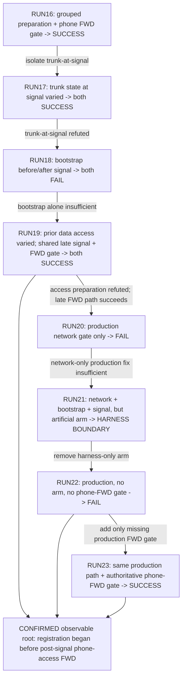

# Voice root-cause implementation retrospective

## Status and evidence contract

This document is a methodology and engineering retrospective for the
approximately four-hour GPT-5.6 Sol + GitHub Copilot Max investigation that
continued from RUN16 and ended with the corrected no-flag production
verification in RUN23.

It is **not** a canonical state source. The authoritative sources are:

1. [`handoff.md`](../../../handoff.md), especially its canonical state block.
2. [`positive_voice_ab_runs.json`](positive_voice_ab_runs.json).
3. The archived artifacts under `data/cp-scale/`.
4. Git history.
5. The production source and tests referenced below.

If this retrospective conflicts with one of those sources, the governed source
wins. The retrospective intentionally summarizes evidence instead of copying
raw JSON.

The following labels keep observation and interpretation separate:

- **MEASURED FACT** - retained runtime evidence from a governed RUN.
- **SOURCE FACT** - behavior or structure directly established by source,
  tests, or Git history.
- **INFERENCE** - the narrow interpretation supported by those facts.
- **LESSON** - a reusable engineering conclusion, not a new observation.

Implementation source range:

```text
STARTING_HEAD = fd7feb02c8535259f4649748194b8e2f0eb51d93
IMPLEMENTATION_CLOSEOUT_HEAD = 77b82fb67a08a8dc4df2f4cd7b84cfa31856650e
```

The seven new artifacts, RUN17 through RUN23, all match the SHA-256 values in
the canonical ledger.

| RUN | Archived artifact under `data/cp-scale/` | Source HEAD | Ledger role |
| --- | --- | --- | --- |
| RUN17 | `positive-voice-ab-run17-trunk-forwarding-no-effect.json` | `4fe8625` | `RUN17_TRUNK_FORWARDING_ORDER_CAUSAL_INTERVENTION` |
| RUN18 | `positive-voice-ab-run18-bootstrap-before-signal-insufficient.json` | `0de600f` | `RUN18_VOICE_BOOTSTRAP_ORDER_CAUSAL_INTERVENTION` |
| RUN19 | `positive-voice-ab-run19-access-preparation-no-effect.json` | `8fdc6ed` | `RUN19_ACCESS_PREPARATION_CAUSAL_INTERVENTION` |
| RUN20 | `positive-voice-ab-run20-production-network-gate-insufficient.json` | `d12e838` | `RUN20_PRODUCTION_FOUNDATION_GATED_VERIFICATION` |
| RUN21 | `positive-voice-ab-run21-production-order-artificial-arm-failure.json` | `a716322` | `RUN21_PRODUCTION_CROSS_STAGE_VERIFICATION` |
| RUN22 | `positive-voice-ab-run22-production-post-signal-convergence-missing.json` | `b842dc1` | `RUN22_PRODUCTION_NO_ARM_VERIFICATION` |
| RUN23 | `positive-voice-ab-run23-production-complete-convergence-success.json` | `852d6ab` | `RUN23_PRODUCTION_COMPLETE_CONVERGENCE_VERIFICATION` |

---

## 1. Starting state after RUN16

### Repository and canonical state

**SOURCE FACT:** The inherited HEAD was `fd7feb0`, commit
`docs(cp-scale): record run16 shared foundation acquisition`, dated
2026-08-30 09:32:18 -05:00.

**SOURCE FACT:** At that HEAD, the canonical handoff classified the Voice root
cause as a strong candidate, not confirmed. It also retained:

```text
RUN16_RESULT = SHARED_PREPARED_FOUNDATION_ACQUISITION
TRUNK_FORWARDING_CONVERGENCE = DIRECTLY_OBSERVED
PRODUCTION_FIX_JUSTIFIED = NOT_YET
CP_SCALE_STATUS = OPEN / NOT VERIFIED
```

### What RUN16 established

**MEASURED FACT:** RUN16 used one 2811, one 3560-24PS, and two 7960 phones on
voice VLAN 930 and data VLAN 931. Before either phone received the voice VLAN,
the bounded foundation observer saw the shared trunk forwarding set move from
empty to `[930, 931]`. It reached a complete VERIFIED aggregate on sample 13
after 31,360 ms.

**MEASURED FACT:** P2 received an edge-policy dispatch and P1 did not, but both
ports followed the same observed STP sequence and reached FWD after 30,782 ms.
Both phones then acquired addresses, matched two DHCP bindings, and registered
with SCCP:

```text
P1 = 10.93.0.11 / matching binding / REGISTERED
P2 = 10.93.0.10 / matching binding / REGISTERED
```

**INFERENCE:** The prepared ordering, not PortFast, received causal credit.
PortFast could not explain a success that occurred on both the dispatched and
non-dispatched arms.

### What RUN16 did not establish

**MEASURED FACT:** RUN16 moved several readiness dimensions together:

- trunk forwarding;
- router Voice L3;
- DHCP pool readiness;
- Option150 and CME/bootstrap readiness;
- elapsed phone/access lifecycle before Voice signalling.

**INFERENCE:** RUN16 proved that the grouped preparation changed the outcome,
but it did not identify which member of the group mattered.

**MEASURED FACT:** The exact phone DHCP transaction remained outside governed
observation:

```text
FRESH_7960_DHCP_TRANSACTION = NOT_INDEPENDENTLY_ESTABLISHED
SERVER_RECEIVES_DISCOVER = UNOBSERVABLE
DHCP_TRANSACTION_PROGRESS = UNOBSERVABLE
```

RUN16 therefore did not prove a one-shot Discover, a dropped Discover, or a
specific retry schedule.

### Modern failure and positive-control conditions

**SOURCE FACT:** In the failing default path, the initial L2 configuration
signalled the voice VLAN while the remaining L3/service work and convergence
were still in progress. Registration observation had no authoritative
phone-facing FWD prerequisite.

**MEASURED FACT:** The modern failure signature was stable:

```text
voice SVI present
DHCP enabled
IPv4 empty
voice binding count 0
SCCP NOT_REGISTERED
```

**MEASURED FACT:** The RUN16 positive condition withheld the voice VLAN until a
prepared foundation existed, then observed the phone-facing ports through FWD
before registration settled.

### Open hypotheses and observer limits

At the RUN16 frontier, the surviving candidate dimensions included:

- trunk forwarding at the signal boundary;
- router L3 readiness;
- DHCP pool readiness;
- Option150/CME/bootstrap readiness;
- prior access-port preparation;
- phone/access convergence after signalling;
- combinations among those conditions.

Known observer limits included:

- the measured-unsupported DHCP server statistics command;
- no independent Discover/DORA counter;
- no governed phone power/boot getter;
- no reliable PortFast runtime marker on this PT build;
- no direct Option150 configuration readback;
- APPLIED mutations that could not be treated as VERIFIED state.

Canonical CP-SCALE remained outside the disposable experiment. No conclusion
about 69-phone closure was licensed at the starting point.

---

## 2. Session objective and constraints

The objective was not to maximize the number of experiments. It was to:

1. identify a causally sufficient observable lifecycle defect;
2. reject plausible but unsupported explanations;
3. implement a generic production dependency/convergence correction only after
   the evidence justified it; and
4. verify that correction through the real no-flag production path.

The investigation operated under the following constraints.

| Constraint | Engineering consequence |
| --- | --- |
| Governed reads only | No arbitrary IOS or JavaScript escape hatch could be used to manufacture observability. |
| APPLIED != VERIFIED | Mutation acceptance could not stand in for state or forwarding. |
| UNKNOWN fails closed | Missing, stale, incomplete, or unattributed evidence could not authorize a later mutation. |
| One changed variable | Each disposable experiment needed a stated causal question and explicit constants. |
| Interpret before rerunning | A valid negative result had to change the next experiment. |
| Preserve artifacts | Every LIVE needed a unique archive, ledger entry, digest, and cleanup result. |
| Separate harness from product | A harness failure could not be called network behavior. |
| No speculative fix stack | No sleeps, retries, toggles, link bounces, or PortFast workaround could be accumulated until something passed. |
| Production-path verification | Experimental success alone could not justify the shipped correction. |
| Canonical topology protected | The 314-device CP-SCALE topology could not be mutated during this investigation. |

**LESSON:** The constraints were part of the causal method. Without them, a
successful final state could have been produced without knowing which action
caused it.

---

## 3. Investigation methodology used by GPT-5.6 Sol + GitHub Copilot Max

### Graph and evidence orientation

**SOURCE FACT:** The repository contains a Graphify knowledge graph and the
closeout ran `graphify update .`. Graph queries were used as navigation, not as
runtime evidence. Important claims were re-established from the handoff,
ledger, artifacts, source, and tests.

The first Graphify query in the new Copilot worktree found no
`graphify-out/graph.json`, so it supplied no initial evidence. The agent fell
back to the handoff and targeted repository reads, then rebuilt the graph
later. This session-tooling fact is included to avoid idealizing the workflow;
no causal conclusion rests on it.

The working orientation sequence was:

```text
Graphify query
-> canonical handoff
-> Voice ledger and archived artifacts
-> Git archaeology
-> targeted source and tests
```

**LESSON:** A graph query is valuable for finding the relevant communities and
call paths. It is not an authority upgrade for the nodes it returns.

### Start with the modern differential

The investigation treated the current failure and RUN16 success as the primary
comparison. Historical manual success remained context, but it did not provide
a reproducible action schedule.

The first working question was:

> What is the earliest behaviorally relevant ordering difference between the
> current failure and RUN16, and which part of that difference changes the
> result?

That question prevented the investigation from jumping directly to DHCP
packet-level speculation.

### Maintain and reduce a hypothesis set

Each LIVE had four explicit components:

1. the causal question;
2. the changed variable;
3. the conditions held constant; and
4. the outcome that would support, refute, or leave the hypothesis
   unobservable.

Negative results were not retries. They reduced or reshaped the search space:

- RUN17 removed trunk-forwarding state *at signal* as the single explanation.
- RUN18 showed bootstrap readiness alone was insufficient.
- RUN19 removed prior data-only access preparation.
- RUN20 showed a network-only production barrier was insufficient.
- RUN21 identified a disposable-only harness mutation.
- RUN22 localized the missing post-signal FWD boundary.
- RUN23 verified the completed correction in production mode.

### Prefer within-run controls, then bridge to production

RUN17-RUN19 used paired phones where useful. The experiments kept shared
topology, router, pool, CME, and observation surfaces together so environmental
variation could not masquerade as a causal effect.

The workflow then deliberately crossed an evidence boundary:

- RUN17-RUN19 explored causal dimensions through explicit experiment modes.
- RUN20-RUN23 used `UNIFORM_BASELINE` and `production_pipeline=true`.
- RUN23 used no experiment flags and no artificial endpoint DHCP arm.

### Autofix instrumentation, not outcomes

Small harness and observer defects were corrected when they prevented the
causal question from being tested:

- before/after bracketing around a trunk-state control;
- bounded bootstrap readiness observation;
- truthful PARTIAL evidence for data-only preparation;
- deterministic configuration action ordering;
- cross-stage callback wiring;
- removal of a disposable-only endpoint arm;
- grouped post-signal STP convergence observation.

The fixes did not inject a successful network state. They made the tested
boundary observable and fail-closed.

### Do not idealize the workflow

The investigation did not jump directly from RUN16 to the final gate. It first
implemented an incomplete network-only production correction, then an
incomplete cross-stage correction, and only later identified the post-signal
FWD prerequisite. RUN20-RUN22 are evidence of that iterative design, not noise
to erase from the history.

---

## 4. Chronological RUN17-RUN23 causal table

| RUN | Causal question | Changed variable | Held constant | Observed result | Strengthened | Weakened/refuted | Harness/observer issue | Why the next RUN followed |
| --- | --- | --- | --- | --- | --- | --- | --- | --- |
| RUN17 | Must trunk VLAN930 already be forwarding when Voice is signalled? | P1 signalled between authoritative non-FWD reads; P2 signalled after the same trunk reached FWD. | Topology, L3, pool, bootstrap, access VLANs, no DHCP mutation, no production config change. | Both phones acquired, matched bindings, and registered; `TRUNK_FORWARDING_BEFORE_VOICE_NO_EFFECT`. | A broader lifecycle/order explanation. | Trunk state *at signal* as the sole cause. | The two signal origins made per-port timing non-comparable; this was retained rather than hidden. | Isolate bootstrap readiness at signal. |
| RUN18 | Is Voice bootstrap readiness before signal sufficient? | P1 before Option150/CME/ephone/cnf; P2 after bootstrap and verified call-control readback. | Same prepared L2/L3/DHCP network, models, VLANs, no arm, no PortFast. | Both failed; at FWD both SVIs were absent, and at window end both were present with DHCP YES but no IPv4. | A later lifecycle/convergence boundary. | Bootstrap readiness alone. | A bounded bootstrap waiter was required so a transient table could not waste the RUN. | Separate prior access preparation from the late signal boundary. |
| RUN19 | Does prior data-only access preparation explain success? | Control had no prior access policy; intervention had data931/no voice. Both then received the same data931+voice930 batch at one late clock. | Phone age, signal time, full foundation, bootstrap, no arm, no PortFast. | Both succeeded after paired authoritative FWD; `DATA_ACCESS_PREPARATION_NO_EFFECT`. | Late signal plus post-signal convergence. | Prior data-only preparation. | Pre-boundary readback was added so preparation asymmetry was observed, not merely asserted by construction. | Move the candidate into the real production path. |
| RUN20 | Is a network foundation gate sufficient in the no-flag production applicator? | Real `ConfigurationApplicator` prepared data-only, verified network, then signalled. | Disposable topology and Voice intent; no experiment mode. | Both failed; network foundation and signal verified, zero bindings. | Need for cross-stage bootstrap ordering. | Network-only correction as sufficient. | The disposable path still carried legacy endpoint-arm behavior; RUN20 was implementation feedback, not final proof. | Put bootstrap before signal in the real cross-stage flow. |
| RUN21 | Does network -> bootstrap -> signal close the production path? | Added cross-stage callback ordering. | No experiment flags; same disposable topology. | Both failed, but the artifact recorded `WHEN_ENDPOINT_DHCP_ARMED` on both phones. | Harness parity as the next requirement. | No product hypothesis was validly tested by this RUN. | **HARNESS DEFECT:** canonical production emits no phone arm, but the disposable qualifier did. | Remove only the disposable artificial arm. |
| RUN22 | With no arm, is network -> bootstrap -> signal sufficient before immediate registration? | Removed the disposable-only endpoint arm. | Real no-flag production path, same topology/config/bootstrap, verified network and signal. | Both failed: DHCP YES, empty IPv4, zero bindings, NOT_REGISTERED. | Missing post-signal phone-access convergence gate. | Endpoint activation and upstream static configuration as remaining explanations. | No authoritative phone-facing FWD observation existed before registration. | Add one grouped read-only FWD gate. |
| RUN23 | Does the complete production lifecycle close Voice? | Added grouped authoritative phone-access FWD verification before registration. | Same no-flag production path as RUN22, no arm, same topology and Voice config. | SUCCESS: 73 shared samples / 31,031 ms to FWD, two IPv4s, two matching bindings, 2/2 REGISTERED. | Observable dependency/order root cause; production fix justified. | Remaining competing observable root causes. | No defect in the causal question; cleanup and ledger verification passed. | Canonical CP-SCALE verification remains a separate phase. |

---

## 5. Causal elimination tree from RUN16 to RUN23



RUN23 was not merely "wait longer and it worked":

- the wait had a typed subject: the exact phone-facing interfaces grouped by
  switch and voice VLAN;
- every sample came from a registered operational query;
- progress required fresh, complete, uniquely attributed evidence;
- only actual FWD rows authorized registration;
- timeout, missing rows, parser gaps, and ambiguous identity remained
  non-authorizing.

---

## 6. The decisive causal boundary

### What RUN19 and RUN22 actually shared

**MEASURED FACT:** Both used:

- one 2811, one 3560-24PS, and two 7960 phones;
- data VLAN 931 and voice VLAN 930;
- the same Voice pool/address plan;
- final VERIFIED trunk, router subinterface, pool-table, and call-control
  foundation readings;
- verified voice-VLAN readback on both phone ports;
- no endpoint DHCP arm.

**SOURCE FACT:** Both used the same registration observer implementation,
configured with a 30-second bound in the disposable runner. A successful
registration episode could end before that bound, so this is not a claim that
RUN19 consumed exactly 30 seconds.

### What differed

**MEASURED FACT:** RUN19 had a paired authoritative phone-facing FWD gate before
registration. Both ports were FWD and both phones succeeded.

**MEASURED FACT:** RUN22 used the no-flag production path with network
foundation VERIFIED, Voice bootstrap applied, and Voice signal VERIFIED, but
it began registration without retaining authoritative phone-facing FWD. Both
phones failed with zero bindings.

**SOURCE FACT:** RUN19 and RUN22 were not the same source revision or the same
orchestration class. RUN19 was an experiment mode; RUN22 was the production
adapter. RUN19 also contained an access-preparation A/B, although both of its
arms succeeded and thereby refuted that variable.

**INFERENCE:** RUN19 versus RUN22 strongly localized the missing FWD boundary,
but it was not, by itself, a perfect one-variable same-revision contrast.
Calling it decisive without that qualification would overstate the evidence.

### Why earlier alternatives no longer explained the split

Before the RUN19/RUN22 comparison:

- RUN17 had refuted trunk state at signal as the sole cause.
- RUN18 had shown bootstrap readiness alone was insufficient.
- RUN19 had refuted prior data-only access preparation.
- RUN20 had shown network convergence alone was insufficient.
- RUN21 had isolated and removed the artificial endpoint arm.

The remaining observable lifecycle difference was registration relative to
phone-facing forwarding.

### What RUN23 added

**SOURCE FACT:** The behavioral source change between RUN22's source
`b842dc1` and RUN23's source `852d6ab` added the grouped post-signal convergence
observer, merged its evidence into the deferred Voice verification, and kept
registration closed until that field verified. The intervening `173a7ac`
commit archived RUN22 evidence.

**MEASURED FACT:** RUN23 used the production path, not an experiment mode. It
retained two VERIFIED convergence results from one grouped sample stream and
then succeeded end to end.

**INFERENCE:** The combined evidence supports `ROOT_CAUSE = CONFIRMED` at the
observable dependency boundary. RUN19 localized the candidate; RUN22
reproduced the failure in production without the gate; RUN23 applied the gate
in that same production path and reversed the outcome.

---

## 7. Confirmed root cause versus unobservable DHCP internals

### Confirmed observable root

**MEASURED FACT:** The failing production path could report:

```text
network foundation = VERIFIED
Voice bootstrap = APPLIED
Voice signal = VERIFIED
phone access FWD before registration = not established
IPv4 = empty
bindings = 0
SCCP = NOT_REGISTERED
```

**MEASURED FACT:** The corrected production path added authoritative
phone-facing FWD before registration and reported:

```text
phone access FWD = VERIFIED 2/2
IPv4 = 10.93.0.10, 10.93.0.11
matching bindings = 2/2
SCCP = REGISTERED 2/2
```

The strongest supported root-cause statement is:

> Registration/acquisition observation began before the newly signalled
> phone-facing ports had authoritatively converged to FWD. The pipeline lacked
> the dependency that ordered registration after network readiness, Voice
> bootstrap, Voice signal verification, and post-signal access forwarding.

### What remains unobservable

The evidence does not establish:

- the exact time a phone emitted DHCP Discover;
- whether a particular Discover was dropped;
- whether the phone emitted one attempt or several;
- which DORA transition, if any, was visible to the server;
- the internal retry or boot-state machine of the PT 7960.

The canonical state correctly retains:

```text
FRESH_7960_DHCP_TRANSACTION = NOT_INDEPENDENTLY_ESTABLISHED
SERVER_RECEIVES_DISCOVER = UNOBSERVABLE
DHCP_TRANSACTION_PROGRESS = UNOBSERVABLE
```

**LESSON:** An observable dependency failure can be causally confirmed without
inventing packet-level mechanics. The fix needs the proven ordering contract,
not an unsupported story about the packets inside it.

---

## 8. Production correction architecture

### Previous lifecycle

The original effective lifecycle was:

```text
CREATE/LINK PHONES
-> ACCESS PORT INCLUDES VOICE SIGNAL
-> REMAINING NETWORK/VOICE WORK
-> REGISTRATION OBSERVATION
```

There was no required authoritative phone-facing FWD observation between the
Voice signal and registration.

### Corrected lifecycle

```text
DATA-ONLY ACCESS
-> NETWORK VERIFIED
-> VOICE BOOTSTRAP
-> VOICE SIGNAL VERIFIED
-> PHONE ACCESS FWD VERIFIED
-> REGISTRATION
```

The sequence is implemented as a cross-stage dependency:

1. `ConfigurationApplicator` identifies phone-facing
   `ConfigureAccessPort` actions carrying `voice_vlan_id`.
2. It dispatches data-only copies and verifies the non-Voice network
   foundation.
3. It retains the original Voice signals as `INTENDED`, not APPLIED.
4. `VoiceApplicator` applies Option150, CME, ephones, bindings, and cnf files.
5. A completion callback dispatches the original access actions.
6. Direct access/voice-VLAN readback and grouped phone-facing FWD observation
   are merged.
7. Foundational statuses are re-derived.
8. Registration begins only if the completed Voice foundation is VERIFIED.

### Why this is not a delay workaround

The correction is not:

- a fixed sleep;
- a blind retry;
- a DHCP flag toggle;
- a link bounce;
- Vlan1 activation;
- PortFast as a Voice workaround.

The waiter polls a stated operational condition and exits as soon as that
condition is established. The default bound is 45 seconds and the default
poll interval is 0.25 seconds, but query execution time also contributes to
elapsed time. RUN23 reached FWD after 73 shared samples / 31,031 ms.

Timeout does not become success. It produces non-authorizing evidence, which
keeps registration closed.

---

## 9. Important implementation changes and where they live

| Source | Important symbols | Responsibility | Key commits/tests |
| --- | --- | --- | --- |
| `src/packet_tracer_mcp/domain/enterprise/models/configuration_runtime.py` | `VoiceSignalBarrierResult` | Retains deferred action ids, preparation, network verification, signal results, post-signal convergence, and aggregate statuses. | `eaff495`, `edb9802`, `852d6ab` |
| `src/packet_tracer_mcp/application/use_cases/apply_configuration.py` | `ConfigurationApplicator.apply`, `_verify_with_voice_signal_barrier`, `complete_deferred_voice_signals`, `_merge_voice_signal_verification` | Prepares data-only access, verifies network, defers Voice, completes signal, merges direct and operational evidence. | `test_voice_vlan_signal_waits_for_network_foundation_verification`, `test_voice_signal_can_be_held_pending_until_bootstrap_then_completed`, `test_unobservable_phone_port_forwarding_keeps_registration_gate_closed` |
| `src/packet_tracer_mcp/application/use_cases/apply_voice.py` | `VoiceApplicator.apply`, `_missing_foundations`, `_after_application_failure` | Allows only an explicitly pending `voice_vlan` foundation, applies bootstrap, invokes completion, rechecks foundations, then observes registration. | `edb9802`; `test_deferred_voice_signal_runs_after_bootstrap_and_before_registration` |
| `src/packet_tracer_mcp/infrastructure/execution/enterprise_configuration_runtime.py` | `wait_for_voice_access_forwarding`, `_wait_voice_access_group` | Groups switch/VLAN expectations and performs bounded authoritative STP observation. | `852d6ab`; `test_voice_access_forwarding_waits_on_one_registered_stp_query` |
| `src/packet_tracer_mcp/application/use_cases/execute_enterprise_reference.py` | nested `complete_voice_signal` callback | Wires generic E5 and E7 application through the cross-stage barrier and re-derives foundational status. | `edb9802` |
| `src/packet_tracer_mcp/application/use_cases/qualify_cp_scale_live.py` | `canonical_stage_configuration_error`, `canonical_configuration_retryable_operational_unknown` | Admits only the typed pending-Voice state and preserves the bounded L3 retry contract. | `edb9802`; `test_canonical_gate_admits_only_typed_voice_signal_pending_bootstrap` |
| `tools/cp_scale_canonical_live.py` | `_stage_voice`, `_execute_stage` completion callback | Wires the canonical stage runner without weakening its evidence gates. | `edb9802`, `a716322` |
| `src/packet_tracer_mcp/application/use_cases/qualify_positive_voice_slice.py` | RUN17-RUN19 experiment modes and production-arm exclusion | Supplies causal experiments and keeps no-flag production free of disposable-only activation. | `4fe8625`, `0de600f`, `8fdc6ed`, `b842dc1` |
| `tools/cp_scale_positive_voice_ab_live.py` | `_ConfigurationAdapter`, `_CallControlAdapter`, no-flag production mode | Bridges the disposable topology to the real production applicators and serializes production barrier evidence. | RUN20-RUN23 sources |
| `docs/reference/cp-scale/positive_voice_ab_runs.json` | RUN17-RUN23 entries | Pins artifact names, source heads, roles, outcomes, and SHA-256 digests. | Seven archive commits |

Small implementation details mattered:

- the no-flag harness orders its hand-built actions through
  `order_configuration_actions` before invoking the real applicator;
- a data-only preparation that occurred but whose Voice signal remained closed
  is retained as PARTIAL, not rewritten as "not applied";
- hard FAILED foundation evidence outranks an earlier UNOBSERVABLE result;
- the canonical L3 re-read helper carries the explicit pending-Voice state;
- legacy failure-evidence fixtures tolerate absence of the new optional barrier
  without changing typed production behavior.

---

## 10. Grouped switch/VLAN forwarding observation

### Why observations are grouped

One switch emits one `show spanning-tree` table covering all VLAN instances and
interfaces. Querying once per phone would:

- multiply runtime cost;
- give phones different sample times;
- make a same-boundary comparison depend on query order.

`wait_for_voice_access_forwarding` therefore groups expectations by:

```text
(device_name, voice_vlan_id)
```

One `_wait_voice_access_group` sample classifies every interface in that group.
RUN23's two phones consequently retained the same 73 attempts and 31,031 ms.

### Authority and parsing

A sample can authorize progress only when the IOS result is:

- executed;
- fresh;
- complete;
- attributed with `confirmed_unique` device identity.

The runtime then:

1. parses the registered `SHOW_SPANNING_TREE` output;
2. selects the exact voice VLAN instance;
3. matches interfaces with `same_interface_name`, reconciling forms such as
   `Fa0/1` and `FastEthernet0/1`;
4. recognizes states beginning with `FWD` or `FORW`;
5. requires every expected interface in the group to be forwarding.

### Non-authorizing outcomes

The following do not authorize registration:

- missing VLAN instance;
- missing interface row;
- LIS, LRN, BLK, or another non-FWD state;
- stale output;
- incomplete/paged-incomplete output;
- unattributed or ambiguously attributed output;
- unsupported/missing runtime method;
- timeout.

These cases return UNOBSERVABLE or PARTIAL merged evidence. They do not become
negative topology claims and they do not become success.

### Polling versus sleep

The waiter uses `StateConvergenceWaiter` with a bounded timeout and interval.
It delegates to `DeviceReadinessWaiter`, whose `clock` and `sleeper` are
injectable and default to `monotonic` and `sleep`. The clock decides when to
stop; the sleeper only schedules the next read; evidence decides whether to
proceed. This is the difference between a convergence gate and a sleep:

- a sleep advances after time whether the state is good or bad;
- the convergence gate advances only after authoritative FWD.

---

## 11. Fail-closed authority and evidence quality

| Situation | Retained meaning | May authorize later work? |
| --- | --- | --- |
| Runtime accepted payload | APPLIED | No, not by itself. |
| Data-only prep applied; Voice pending | PARTIAL + signal INTENDED | Bootstrap may run through the explicit callback contract; registration may not. |
| Network verification is UNKNOWN | UNKNOWN | No. |
| DHCP pool direct configuration readback unavailable | Governed UNOBSERVABLE ceiling | Only the explicitly admitted pool ceiling; it does not verify fields the backend cannot read. |
| Voice signal direct readback verified, FWD missing | PARTIAL | No. |
| STP output incomplete or unattributed | UNOBSERVABLE | No. |
| Direct access and grouped FWD both verified | VERIFIED merged Voice foundation | Yes. |
| Final IPv4/SCCP success without causal preconditions | Final state only | No causal promotion. |

Three source rules protected the investigation:

1. **VERIFIED is copied from authoritative evidence, never minted.**
2. **A missing observer cannot silently become a default success.**
3. **The registration gate rechecks the completed foundation after the callback.**

These rules mattered causally. A fail-open read would have allowed the pipeline
to advance and then made a later success or failure uninterpretable.

---

## 12. Harness and observer defects encountered

| Classification | Defect or boundary | How it was prevented from becoming a network conclusion |
| --- | --- | --- |
| HARNESS RISK, fixed before RUN17 | A check-then-act trunk test could have allowed the trunk to converge during the control signal. | The control signal was bracketed by authoritative non-FWD reads. |
| HARNESS RISK, fixed before RUN17 | Fixed P1/P2 roles could alias port identity with treatment. | Reverse-role support was implemented; null results made a second LIVE unnecessary. |
| OBSERVER RISK, fixed before RUN18 | One immediate post-bootstrap read could confuse slow readiness with failure. | A bounded bootstrap waiter retained samples and failure dimensions. |
| EVIDENCE DEFECT, fixed offline | Data-only preparation could be hidden as DEPENDENCY_BLOCKED after Voice remained closed. | `VoiceSignalBarrierResult` retains preparation truth; final action state remains PARTIAL. |
| EVIDENCE DEFECT, fixed offline | An early UNOBSERVABLE foundation could mask a later FAILED dimension. | Aggregate precedence gives FAILED priority. |
| HARNESS DEFECT, fixed offline | Hand-built no-flag actions were not initially in deterministic applicator order. | The adapter calls `order_configuration_actions`; a test pins the production path. |
| PRODUCT DESIGN INCOMPLETENESS, RUN20 | Network verification happened before signal, but bootstrap still followed signal. | RUN20 was archived as insufficient, then the production path was split across E5/E7 with a completion callback. |
| HARNESS DEFECT, RUN21 | The disposable qualifier called `configure_endpoint_dhcp`, although canonical production emits no phone activation. | RUN21 was classified as a harness boundary; the no-flag path marks activation NOT_APPLICABLE. |
| PRODUCT DEFECT, RUN22 | Registration began immediately after a verified late signal without phone-facing FWD evidence. | RUN22 was archived as the production failure; RUN23 added the read-only grouped gate. |
| COMPATIBILITY DEFECT, fixed offline | Canonical fake results lacked the new optional barrier and the L3 retry helper initially omitted pending-Voice state. | Optional fixture access and explicit retry threading restored existing contracts without weakening production. |
| HARD OBSERVABILITY LIMIT | Discover/DORA and exact phone retry behavior remain unavailable. | The root cause stops at the observable dependency boundary. |

**LESSON:** An instrumentation defect is not a failed causal hypothesis. The
RUN must first demonstrate that it actually tested its stated question.

---

## 13. What the agent did especially well

### It did not become attached to RUN16's leading explanation

RUN16 made trunk convergence look compelling. RUN17 directly tested it and
accepted the null result when both phones succeeded. The investigation did not
preserve trunk-at-signal as a favored story after the evidence removed it.

### It treated negative LIVEs as state transitions

Each negative changed the next question:

- RUN18 moved from bootstrap to access history.
- RUN20 moved from network-only to cross-stage ordering.
- RUN21 moved from product interpretation to harness parity.
- RUN22 moved from upstream ordering to post-signal forwarding.

No valid negative was answered by rerunning the same topology until it passed.

### It separated final success from causal proof

RUN16 and RUN19 succeeded, but neither was immediately declared the production
fix. The investigation continued until:

- the failure reproduced through the no-flag production path;
- the missing boundary was isolated;
- the production path itself implemented the boundary; and
- RUN23 succeeded without experiment flags.

### It kept harness defects visible

RUN21 was not relabeled as a product failure. Its artifact and ledger entry
explicitly state that the production question was not tested because of the
artificial endpoint arm.

### It preserved authority under pressure to progress

The source continued to reject UNKNOWN, incomplete output, missing methods,
and unattributed IOS results. The final gate succeeded because evidence became
VERIFIED, not because the acceptance criteria were weakened.

### It used modern controls

The decisive reasoning used current PT 9.0.1.0858 artifacts and current source,
not the timing assumptions of a historical manual demonstration.

---

## 14. What could have been done better

### The post-signal lifecycle should have been modeled sooner

RUN16 already contained an important clue: success followed a 30.782-second
phone-facing FWD gate before registration. RUN18 then showed both SVIs absent
at FWD and present with DHCP enabled only at the end of the registration
window. A stronger early lifecycle model might have made "registration starts
before access FWD" a first-class candidate sooner.

That is hindsight, not proof that RUN17-RUN19 were unnecessary. At RUN16, trunk
state, bootstrap order, and access preparation still moved together and needed
separation.

### RUN19 versus RUN22 should not be presented as a perfect isolated A/B

They used different orchestration paths and source revisions. RUN19 also
contained an access-preparation treatment. Its within-run null result removes
that treatment as an explanation, but the cross-run comparison still required
RUN23's production-path intervention to close the case.

The better wording is:

```text
RUN19 vs RUN22 localized the missing boundary.
RUN22 vs RUN23 confirmed it in the production path.
```

### Production-parity review should have preceded the first no-flag LIVE

Two issues were discoverable offline:

- deterministic action ordering for the hand-built production plan;
- the disposable-only endpoint DHCP arm.

The first was corrected before it could invalidate a LIVE. The second was not
removed until RUN21 exposed it, consuming a governed RUN. A source-level parity
check comparing canonical phone actions with the disposable no-flag path should
have been an explicit pre-LIVE gate.

### RUN20 implemented too narrow a correction

The first production change delayed Voice until network verification but still
placed signal before Voice bootstrap. RUN18 had already shown that bootstrap
alone was insufficient, but it did not prove bootstrap was unnecessary. A
dependency graph covering both E5 and E7 before coding might have avoided this
intermediate implementation.

### The experiment harness became large

The implementation range changed 24 files with 4,984 insertions and 143
deletions. Most of that growth is typed evidence, causal modes, tests, and
handoff continuity, but `qualify_positive_voice_slice.py` alone gained more
than one thousand lines.

**LESSON:** A future refactor should separate reusable experiment scheduling,
foundation observation, and evidence serialization. That refactor was outside
this root-cause task and should not be mixed into the verified fix.

### Documentation state drift was caught late

At retrospective start, two canonical state fields still reflected an
intermediate checkpoint:

- `RAW_VOICE_AB_RUNS_PINNED = 14` despite 21 ledger entries;
- `FIRST_CAUSAL_DIVERGENCE = NOT_YET_ESTABLISHED...` beside a confirmed root.

The retrospective work reconciled those documentation fields through the
existing exact-state test before using them here.

### Some missing observability is genuinely hard

It would have been useful to observe Discover/DORA and phone boot state from
the beginning. PT 9.0.1.0858 did not provide the governed surfaces needed.
Inventing them in hindsight would not be an improvement.

---

## 15. Session metrics

### Time and source range

**SOURCE FACT:** Git timestamps span:

```text
fd7feb0  2026-08-30 09:32:18 -05:00
77b82fb  2026-08-30 13:11:59 -05:00
```

That is approximately 3 hours 40 minutes of repository-visible activity,
consistent with describing the session as approximately four hours. The first
new implementation commit was at 10:13:01; orientation and evidence review
preceded it.

### Output metrics

| Metric | Value |
| --- | --- |
| Governed LIVEs consumed | 7 (`RUN17`-`RUN23`) |
| New archived artifacts | 7 |
| Total ledger entries after closeout | 21 |
| Commits after starting HEAD | 17 |
| Implementation-range diff | 24 files, 4,984 insertions, 143 deletions |
| Focused closeout | 325 passed, 1 skipped (session command output) |
| Affected closeout | 231 passed (session command output) |
| Full closeout | 3,426 passed; 1 documented pre-existing stale handoff assertion; 4 warnings (session command output) |
| Graphify | `graphify update .` completed |
| Diff gate | `git diff --check` passed |
| Ledger gate | 21 compared, 0 mismatched |
| Cleanup | Realtime and zero semantic devices/links independently restored after every new LIVE |
| Final disposable production result | RUN23 SUCCESS |

The full-suite failure was the pre-existing
`test_handoff_names_the_new_bounded_window_and_keeps_live_open` assertion
pinned to an old implementation head. It was not introduced or broadened by
the Voice correction.

The three test totals above are operational validation records from the session
command output. They are not RUN evidence and are not independently encoded in
the Voice ledger; the retrospective uses them only as closeout metrics, never
as support for the root-cause conclusion.

### Relevant commits

| Commit | Purpose |
| --- | --- |
| `4fe8625` | RUN17 trunk-readiness causal mode |
| `0de600f` | RUN18 bootstrap-order causal mode |
| `8fdc6ed` | RUN19 access-preparation causal mode |
| `eaff495` | First production network foundation barrier |
| `edb9802` | Cross-stage network -> bootstrap -> signal ordering |
| `b842dc1` | Removal of disposable-only endpoint arm |
| `852d6ab` | Authoritative post-signal phone-access FWD gate |
| `6dffd6f`, `ca3aa71`, `d6b8d35`, `9b2b0f7`, `f6a636f`, `173a7ac`, `8a9be66` | RUN17-RUN23 evidence archive commits |
| `77b82fb` | Root-cause closeout and CP-SCALE applicability record |

### Hypotheses eliminated or bounded

Eliminated or materially weakened:

- trunk forwarding at signal as the single cause;
- PortFast as the differentiator;
- prior data-only access preparation;
- bootstrap readiness alone;
- network convergence alone;
- DHCP flag activation/retrigger as a sufficient fix;
- pool absence and exhaustion for the disposable;
- the disposable endpoint arm as production behavior.

Still unobservable:

- exact phone boot state;
- Discover/DORA progression;
- packet-level retry mechanics.

---

## 16. Reusable investigation principles

### Modern positive control beats historical archaeology

Current code, current PT build, and retained current artifacts expose real
differences. Historical manual success can suggest a direction, but it cannot
provide an exact causal schedule when its timing was not retained.

### Change one variable and retain the constants

Without explicit constants, a success can be credited to whichever hypothesis
the investigator already prefers. The RUN17-RUN19 table makes the constants
part of the result.

### Search for the first divergence

Final `REGISTERED` versus `NOT_REGISTERED` is too late to diagnose. The useful
boundary was registration relative to phone-facing FWD.

### APPLIED is not VERIFIED

An accepted mutation says what the process attempted. A readback says what the
runtime became. Conflating them destroys both safety and causal meaning.

### Final state is not causal proof

RUN16 and RUN19 success narrowed the search but did not verify the production
implementation. RUN23 did.

### UNKNOWN does not authorize

Proceeding through missing evidence turns an experiment into an uncontrolled
run. Fail-closed behavior preserves the ability to interpret the next result.

### Separate observer/harness failure from product failure

RUN21 is the model example. The network result could not answer the production
question because the harness added a mutation production did not contain.

### Update the hypothesis space after every negative LIVE

A negative result earns its cost only when it removes a branch or changes the
next experiment.

### Do not implement production behavior from correlation alone

The grouped success of RUN16 justified more causal work, not an immediate
sleep or PortFast patch.

### Fix dependencies, not symptoms

The final correction encodes which verified states must exist before
registration. It does not manipulate the phone until the symptom disappears.

### A convergence gate is stronger than a sleep

Time is bounded, but state authorizes. That makes timeout diagnosable and
prevents slow or broken systems from being treated alike.

### Verify through the unmodified production path

Experiment flags answer causal questions. They do not prove that the product
uses the corrected behavior. RUN23's no-flag requirement was essential.

---

## 17. Applicability beyond Voice

### Generalizable method

The method applies wherever mutation and observable effect are temporally
separated:

| Domain | Candidate first divergence | Useful governed gate |
| --- | --- | --- |
| DHCP | Client activation versus server/path readiness | Lease/binding or authoritative transaction stage when available |
| Routing | Configuration accepted versus adjacency/route installation | Neighbor state plus route-table evidence |
| STP | VLAN/port membership versus forwarding | Fresh complete per-instance FWD rows |
| ACL propagation | Rule dispatch versus enforcement | Readback plus controlled allowed/denied probes |
| Wireless | SSID/security config versus association | Association state and address acquisition |
| Stateful bootstrap | Service config versus dependent client start | Service readiness, generated artifacts, then client activation |
| Distributed control plane | Local mutation versus cluster convergence | Quorum/version/epoch evidence before consumers start |

The common sequence is:

```text
declare hypothesis
-> identify first observable divergence
-> design one-variable contrast
-> retain authority and constants
-> interpret negative result
-> encode dependency
-> verify through production
```

### Voice-specific implementation detail

The following should not be generalized blindly:

- VLAN930/VLAN931;
- Cisco 7960 SVI behavior;
- SCCP and `show ephone`;
- PT's STP table representation;
- the measured 45-second bound;
- Option150/CME/cnf ordering.

The reusable concept is dependency on authoritative readiness, not these
specific protocols or numbers.

---

## 18. Lessons for future Agent Skills and evals

### A causal-investigation Skill should maintain explicit state

A reusable Skill should track:

- current hypotheses and strength;
- evidence supporting and opposing each;
- already-refuted branches;
- observer ceilings;
- the next causal question;
- permitted mutation budget;
- artifact and cleanup state.

The state should distinguish `SUPPORTED`, `WEAKENED`, `REFUTED`,
`NEEDS_CAUSAL_TEST`, and `UNOBSERVABLE`.

### Required Skill workflow

1. Query repository structure.
2. Load the canonical state and evidence ledger.
3. Build a current failure/positive differential.
4. Select the earliest observable divergence.
5. Propose one changed variable and enumerate constants.
6. Verify preconditions before mutation.
7. Archive exact output and cleanup evidence.
8. Update hypothesis strength.
9. Refuse a production change until a causal boundary is supported.
10. Require a no-flag production verification.

### Evaluation scenarios

Useful evals should include:

- a plausible initial hypothesis that a later null result refutes;
- a successful run with two variables changed, which must not receive causal
  credit;
- an APPLIED mutation whose state readback fails;
- an incomplete or unattributed observer result;
- a harness-only mutation that makes the production comparison invalid;
- a transient condition requiring a bounded waiter;
- a final success available only through an experiment flag;
- a production path where the correct gate reverses the failure.

### Scoring criteria

An agent should receive credit for:

- shrinking the hypothesis space after a negative result;
- stating what remained constant;
- preserving UNKNOWN/UNOBSERVABLE;
- identifying a harness boundary;
- separating root cause from internal mechanism;
- producing a generic dependency fix;
- validating through the production path.

It should lose credit for:

- repeating a valid negative without a new question;
- claiming packet internals from final state;
- using sleep as causal evidence;
- weakening an authority gate to obtain progress;
- treating a harness failure as product behavior;
- calling a flagged experiment a production verification.

### Stopping rules

The Skill should stop when either:

1. one observable causal mechanism explains failure and correction, and the
   real production path independently verifies it; or
2. a named observer boundary prevents further causal separation.

That stopping rule prevents both premature closure and endless experiment
generation.

---

## 19. Final state

### Verified

**MEASURED FACT:** RUN23 verified the no-flag production lifecycle:

```text
DATA-ONLY ACCESS
-> NETWORK VERIFIED
-> VOICE BOOTSTRAP APPLIED
-> VOICE SIGNAL VERIFIED
-> PHONE ACCESS FWD VERIFIED 2/2
-> REGISTRATION
```

It produced:

```text
P1 IPv4 = 10.93.0.10
P2 IPv4 = 10.93.0.11
voice bindings = 2, both matching
SCCP = REGISTERED 2/2
workspace restored = YES
Realtime restored = YES
```

### Root-cause strength

The repository supports:

```text
VOICE_ROOT_CAUSE = CONFIRMED
FIRST_CAUSAL_DIVERGENCE =
    REGISTRATION_START_BEFORE_POST_SIGNAL_PHONE_ACCESS_FWD
PRODUCTION_FIX_JUSTIFIED = YES
```

This strength rests on RUN19/RUN22 localization plus RUN23 production-path
confirmation, not on an inferred DHCP packet trace.

### Production correction

The verified correction is a typed dependency and convergence contract:

- data-only preparation;
- authoritative network verification;
- Voice bootstrap;
- deferred Voice signal and direct readback;
- grouped authoritative phone-access FWD;
- only then registration.

UNKNOWN and UNOBSERVABLE remain non-authorizing.

### Still unobservable

```text
FRESH_7960_DHCP_TRANSACTION = NOT_INDEPENDENTLY_ESTABLISHED
SERVER_RECEIVES_DISCOVER = UNOBSERVABLE
DHCP_TRANSACTION_PROGRESS = UNOBSERVABLE
```

### Outside this investigation

The canonical compiler audit found 69 phones and 69 affected voice-access
actions. No topology regeneration is required because the correction changes
runtime sequencing and observation, not topology or assignments.

Canonical CP-SCALE itself was not mutated. Disposable production verification
therefore justifies the correction but does not close the canonical deployment:

```text
CP_SCALE_STATUS =
    OPEN / FIX VERIFIED DISPOSABLE / CANONICAL NOT MUTATED
NEXT_ACTIVE_STEP =
    CANONICAL_CP_SCALE_VERIFICATION_IF_SEPARATELY_AUTHORIZED
```
